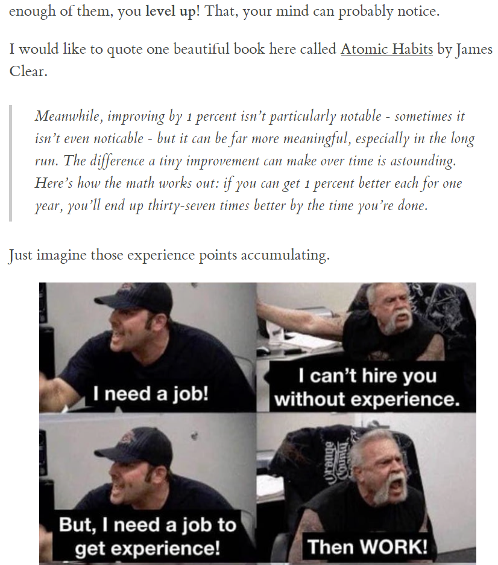

# Pandoc and Markdown magic

## Overview

I'm a massive fan of [pandoc](https://pandoc.org/) and Markdown syntax
so naturally I also I'm interested in having templates for many different
types of content that I produce and keep in the Markdown source
like slides, articles, notes and hopefully books.

This repository is (at the moment) devoted to keeping all of my
HTML styles required for `pandoc` to nicely convert MD source
into beautiful HTML. In the future, I will update it so that
all of my templates, scripts and useful extensions are kept here
with useful examples and tips on how to use them.

### Credits

Styles `tufte` and `github` have been taken from [this](https://github.com/otsaloma/markdown-css)
repository and some minor modification have been done
to tweak them to my liking.

In the future, I plan to probably create a few more styles.

## How to use (MD to HTML)

Let's assume you have your source in `hello.md` and wish to
produce it as an HTML article that someone can enjoy
reading.

You can do something like:

```
pandoc hello.md \
    --output hello.html \
    --to=html5 \
    --css=tufte.css \
    --higlight-style=haddoc \
    --self-contained
```

assuming that `tufte.css` is in the same directory as `hello.md`.

In my case, I like to put these files somewhere globally on my
system so that I can access them from multiple repositories.

### `github.css`


### `tufte.css`


